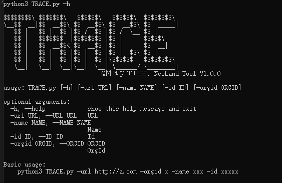
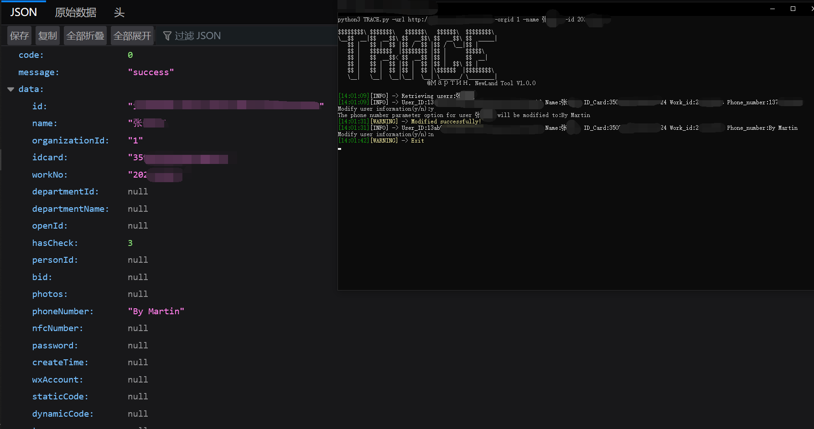

  <div align="center">
 <p align="center">
 
 
 
  
 
 
 </p>
  
  
   
 <table>
  <tr>
      <th>Function</th>
  </tr>
  <tr>
    <th>Access to sensitive information</th>
  </tr>
 
 </table>
</div>

## usage method
  * View help information

      ```#python3 TRACE.py -h```

    

# Access to sensitive information


 ```#python3 TRACE.py -url http://a.com -orgid x -name xxx -id xxxxxxx```
 
  
    


